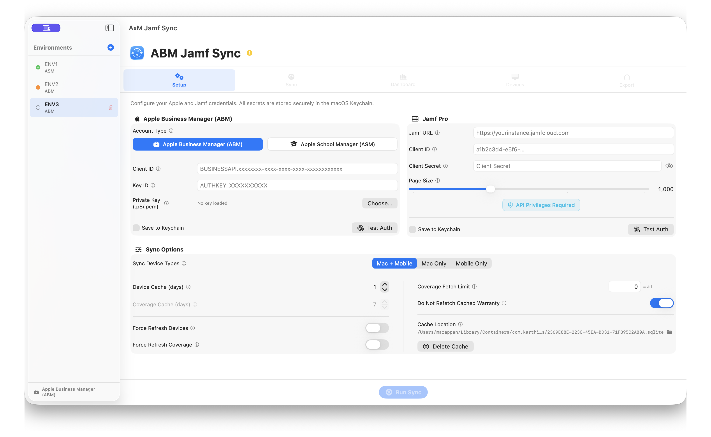
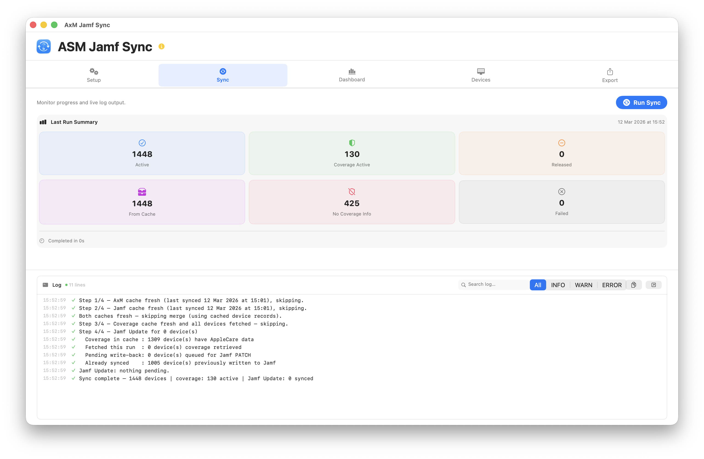
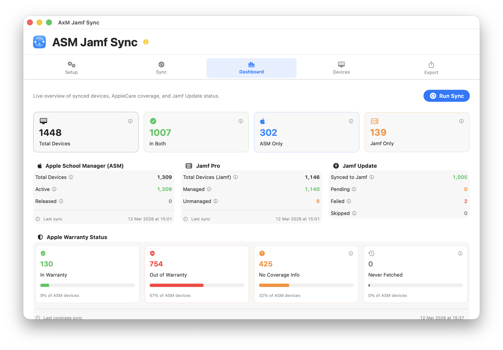

<div align="center">

# ABM Jamf Sync Bridge

<p align="center">
  <a href="#what-it-does">What it does</a> •
  <a href="#requirements">Requirements</a> •
  <a href="#installation">Installation</a> •
  <a href="#quick-start">Quick Start</a> •
  <a href="#tabs-overview">Tabs Overview</a> •
  <a href="https://github.com/karthikeyan-mac/AxMJamfSync/wiki">Wiki</a> •
  <a href="#license">License</a>
</p>

**Sync AppleCare warranty coverage from Apple Business Manager (ABM) or Apple School Manager (ASM) into Jamf Pro — across multiple environments, in four steps, on one Mac.**

[](https://www.apple.com/macos/)
[](https://swift.org/)
[](https://developer.apple.com/xcode/swiftui/)
[](LICENSE)
[](https://developer.apple.com/support/code-signing/)
[](https://developer.apple.com/documentation/security/notarizing_macos_software_before_distribution)

</div>

---

## What it does

ABM Jamf Sync Bridge runs a four-step pipeline on demand:

| Step | What happens |
|------|-------------|
| **1 — ABM Devices** | Downloads every device record from your ABM or ASM organisation |
| **2 — Jamf Inventory** | Downloads computers and mobile devices from Jamf Pro |
| **3 — AppleCare Coverage** | Fetches warranty and AppleCare status from Apple's coverage API |
| **4 — Jamf Update** | Writes warranty date, AppleCare agreement number, vendor, PO number, and PO date back to each matching Jamf record |

The result: every device record in Jamf Pro shows accurate, up-to-date warranty and purchasing information pulled straight from Apple — no spreadsheets, no manual entry.

---

## What's new in v2.0 — Multi-Environment

v2.0 introduces **Environments** — fully isolated configurations for MSPs or admins who manage multiple Apple/Jamf tenants.

Each environment has its own:
- ABM or ASM credentials (Keychain-isolated per environment)
- Jamf Pro credentials and server URL
- Device cache (separate SQLite database)
- Sync preferences and timestamps
- Log file

Switch environments instantly from the sidebar. One sync runs at a time. Existing v1 data migrates automatically into a "Default" environment on first launch — no cache wipe required.

---

## Screenshots

#
#
#
#
#

---

## Requirements

- **macOS 14.0 (Sonoma)** or later
- **Apple Business Manager** or **Apple School Manager** with API access
- **Jamf Pro** (cloud or on-prem) with an OAuth API client
- An Apple API private key (`.pem` file) from ABM/ASM

---

## Disclaimer

This app was developed with the help of AI agents. Please test thoroughly before using in production. Submit bugs and feature requests in the **Issues** section.

---

## Installation

### Option A — Download release (recommended)

1. Download `AxMJamfSync.dmg` from the [Releases](../../releases) page
2. Open the DMG and drag **AxM Jamf Sync** to Applications
3. Launch — it is signed and notarized, Gatekeeper opens it without warnings

### Option B — Build from source

```bash
git clone https://github.com/karthikeyan-mac/AxMJamfSync.git
cd AxMJamfSync
open AxMJamfSync.xcodeproj
```

Select your team in **Signing & Capabilities**, then build with **⌘B**.

---

## Quick Start

### 1 — Create an Apple API Key

1. Sign in to [business.apple.com](https://business.apple.com) or [school.apple.com](https://school.apple.com)
2. Go to **Settings → API** → click **+** to create a new key
3. Download the `.pem` file — Apple only lets you download it once
4. Note the **Client ID** and **Key ID**

### 2 — Create a Jamf Pro API Client

1. Go to **Settings → API Roles and Clients**
2. Create a **Role** with: Read Computers, Read Mobile Devices, Update Computers, Update Mobile Devices
3. Create a **Client**, assign the role, generate a **Client Secret**

### 3 — Configure AxM Jamf Sync

1. Launch the app — your setup opens in the sidebar as **Default**
2. In **Setup → Apple Manager**, enter your Client ID and Key ID, load your `.pem` file
3. Tick **Save to Keychain** and click **Test Auth** — green ✓
4. In **Setup → Jamf Pro**, enter URL, Client ID, and Client Secret
5. Tick **Save to Keychain** and click **Test Auth**

### 4 — Run a sync

Go to the **Sync** tab and click **Run Sync**.

### 5 — Add more environments (v2.0)

Click **+** in the sidebar, give it a name, and configure separate credentials in Setup. Each environment is fully isolated.

---

## Documentation

Full guides: [Project Wiki](https://github.com/karthikeyan-mac/AxMJamfSync/wiki)

---

## Tabs overview

| Tab | Purpose |
|-----|---------|
| **Setup** | Credentials, cache settings, sync options |
| **Sync** | Run, monitor, and stop syncs; view the live log |
| **Dashboard** | Device counts, coverage breakdown, ring chart, last-run stats |
| **Devices** | Searchable, filterable table of every device |
| **Export** | CSV export with presets and configurable columns |

---

## Privacy & Security

- **No data leaves your Mac** except to Apple's ABM/ASM API and your own Jamf Pro server
- All credentials stored in the **macOS Keychain** (`kSecAttrAccessibleWhenUnlockedThisDeviceOnly`), namespaced per environment
- TLS certificate validation enforced on every connection
- JWT client assertions use ES256 with a 10-minute lifetime
- Log files written to `~/Library/Logs/AxMJamfSync/` with `0600` permissions
- Fully **App Sandboxed**

---

## Sync behaviour

- **Caching** — device list cached 1 day, coverage 7 days by default. Second run same day skips re-downloading unless Force Refresh is enabled
- **Sync Device Types** — choose Mac + Mobile (default), Mac Only, or Mobile Only
- **Coverage Fetch Limit** — cap Apple API calls per run; next run resumes exactly where the last stopped
- **Do Not Refetch** — skip devices already checked, reducing API calls significantly
- **Purchasing fields** — PO Number, PO Date, and Vendor (formatted as `"purchaseSourceType (purchaseSourceId)"`) are written to Jamf alongside warranty data
- **External change detection** — if warranty date, vendor, PO number, or PO date are edited in Jamf after a sync, the next run re-queues those devices automatically

---

## Troubleshooting

| Problem | What to check |
|---------|---------------|
| Test Auth fails for ABM/ASM | Confirm Client ID, Key ID, and `.pem` file match the key in ABM/ASM |
| Test Auth fails for Jamf | No trailing slash on URL; confirm API client hasn't expired |
| Coverage shows 0 fetched | Check ABM/ASM has the correct records; confirm API key not revoked |
| Jamf Update all Failed | Confirm API Role includes Update Computers / Update Mobile Devices |
| In Both count is 0 | Run a full sync (Step 1 + Step 2) so devices can be matched by serial |
| App won't open (Gatekeeper) | Right-click → Open on first launch, or download the signed release |

Full log: **Help → Open Sync Log in Console** or `~/Library/Logs/AxMJamfSync/`

---

## Project structure

```
AxMJamfSync/
├── Models.swift                  — Data types, enums, Device struct
├── AppStore.swift                — @MainActor state, CoreData CRUD, filtering
├── AppPreferences.swift          — UserDefaults (env-namespaced in v2)
├── PersistenceController.swift   — CoreData stack, per-environment SQLite
├── KeychainService.swift         — Keychain CRUD, env-namespaced credentials
├── ABMService.swift              — Apple ABM/ASM API (devices + coverage)
├── JamfService.swift             — Jamf Pro API (computers + mobile + PATCH)
├── SyncEngine.swift              — 4-step pipeline orchestration
├── LogService.swift              — Per-environment log (UI + rotating file)
├── EnvironmentStore.swift        — Multi-environment management (v2)
├── ContentView.swift             — NavigationSplitView root
├── EnvironmentSidebarView.swift  — Environment sidebar (v2)
├── SetupView.swift               — Credentials + settings UI
├── SyncPanelView.swift           — Sync progress and live log
├── DashboardView.swift           — Stats tiles and coverage ring chart
├── DevicesView.swift             — Device table with filtering
└── ExportView.swift              — CSV export with presets
```

---

## License

MIT — see [LICENSE](LICENSE)

---

## Acknowledgements

- **Apple** — [SwiftUI](https://developer.apple.com/xcode/swiftui/) framework
- **Jamf** — [Jamf Pro API](https://developer.jamf.com/) documentation
- **Mac Admins India** — https://macadmins.in/
- **Jamf Nation Community** — Feedback and feature requests
- **AI** — [ChatGPT](https://chatgpt.com) & [Claude](https://claude.ai/)

---

**AxM Jamf Sync** is not affiliated with, endorsed by, or sponsored by Jamf Software LLC. Jamf and Jamf Pro are trademarks of Jamf Software LLC.

<div align="center">
Developed by <a href="https://www.linkedin.com/in/bewithkarthi/">Karthikeyan Marappan</a>
</div>
